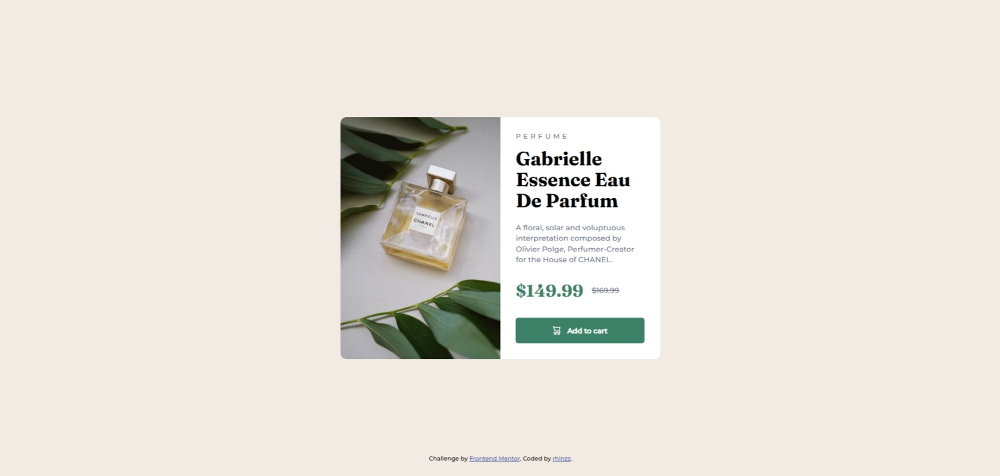

# Frontend Mentor - Product preview card component solution

This is a solution to the [Product preview card component challenge on Frontend Mentor](https://www.frontendmentor.io/challenges/product-preview-card-component-GO7UmttRfa). Frontend Mentor challenges help you improve your coding skills by building realistic projects. 

## Table of contents

- [Overview](#overview)
  - [The challenge](#the-challenge)
  - [Screenshot](#screenshot)
  - [Links](#links)
- [My process](#my-process)
  - [Built with](#built-with)
  - [What I learned](#what-i-learned)
- [Author](#author)

## Overview

### The challenge

Users should be able to:

- View the optimal layout depending on their device's screen size
- See hover and focus states for interactive elements

### Screenshot

### Links

- Live Site URL: Coming Soon

## My process

### Built with

- Semantic HTML5 markup
- CSS custom properties
- Flexbox
- CSS Grid
- Mobile-first workflow

### What I learned

In this project, I've learned to create responsive layout in the card using flexbox CSS. I also learned how to style interactive elements from user input.

### Useful resources

- [W3Schools](https://www.w3schools.com/) - This helped me for learning HTML and CSS basics. I really liked this pattern and will use it going forward.
- [Youtube](https://www.youtube.com) - This helped me with useful guides to sped up the building process

## Author

- Frontend Mentor - [@rhinzz](https://www.frontendmentor.io/profile/rhinzz)